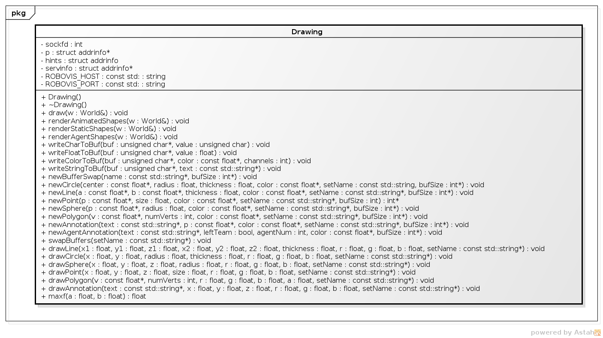
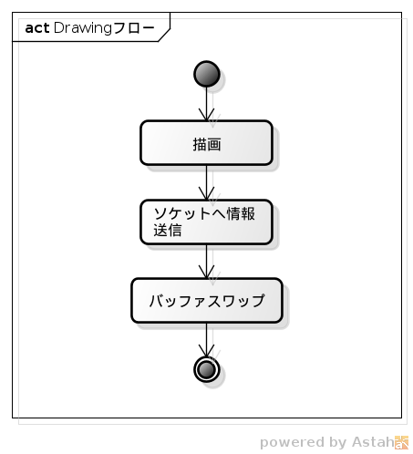

#Drawing
---

　ここではエージェントプログラムのDrainwgクラスについて説明をします.
Drawingクラスでは,RoboVizのDrawing機能を使うことでモニターに描画をすることができます.

---
## Class Diagram

 Drawingのクラス図は以下のようになっています：

---
## Flow

 Drawingの流れは至ってシンプルになっています：
 

なお,  
コンストラクタでサーバのポート32769につなぐ(コンストラクタでソケット接続).  
デストラクタでソケットの接続を切り離します.  

描画には基本的な関数が用意されているので,それを用いることで簡単に任意の描画をすることができます.

- drawLine       : 始点と終点を設定することで線を描くための関数.
- drawCirlce     : 中心と半径を指定して円を描くための関数.
- drawPoint      : 点や大きさを指定してポイントを描くための関数.
- drawPolygon    : 辺数と場所を指定することで多角形を描くための関数.
- drawAnnotation : 点とメッセージを指定することでアノテーションを表示する関数.

