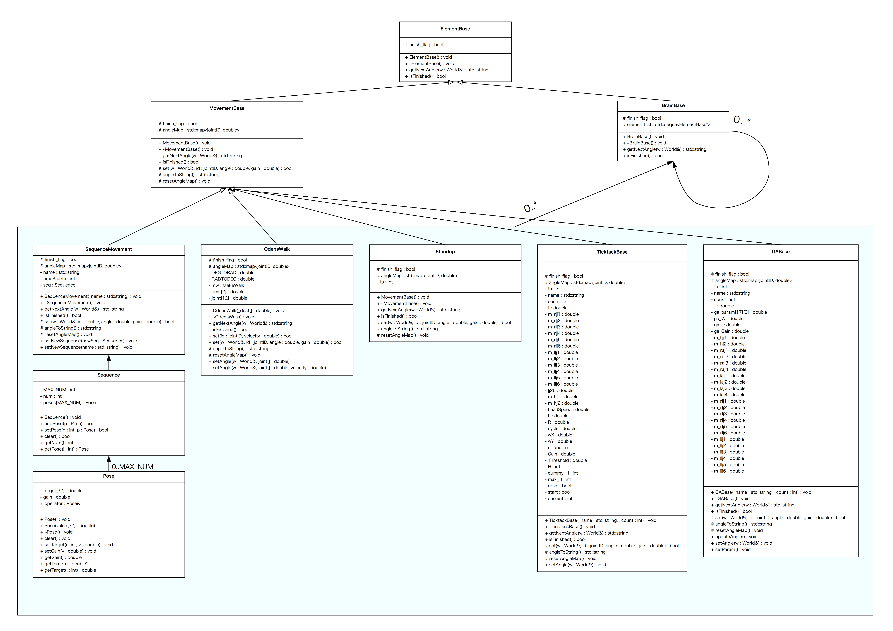

# (Element/Brain/Movement) Class
---

ここではElementBaseクラス及び、
そのサブクラスであるBrainBaseとMovementBaseの機能と役割について説明します。

---
## Class Diagram

継承関係などのクラス図は以下のようになっています：  

最も抽象的なElementBase、
それを継承するBrainBaseとMovementBaseという二つのクラスが存在します。
実際に戦略の判断を行うことになるクラスはこのうちのBrainBaseを継承することになります。
BrainBaseクラスは内部にElementBaseクラスのインスタンスに対するポインタを要素に取る配列、
elementListというメンバ変数をもっています。
このリストに任意のBrainBaseを継承するクラスもしくはMovementBaseを継承するクラスを積んでいき、
毎フレームごとに先頭から順番に実行していくことが主な流れとなります。
以下でそれぞれのクラス、及びそのサブクラスについて説明します。

---

## ElementBase

すべての基本となるクラスとしてElementBaseという抽象クラスがあります。
エージェントの戦略をクラスの木構造として表現し、
自分が枝として持つ任意の要素に対して同じメソッドでアクセスできるように、
BrainBaseクラスとMovementBaseクラスは同じElementBaseクラスを継承しています。
ElementBaseクラスはisFinished()とgetNextAngle(World& w)という二つの抽象メソッドを持つので、
自分が枝として持つ要素に対しては毎シーケンス毎にこの二つのメソッドを通してアクセスすることになります。

---

## BrainBase

ボールに向かって走る、シュートをする、またはより抽象的なFWロボットの戦略の部分など、
エージェントが判断をする戦略全般について、
このBrainBaseクラスを継承したクラスが責任を持ちます。
エージェントの戦略はこのBrainBaseを継承したクラスと、
後述のMovementBaseを継承したクラスからなる木構造で表現されるので、
上記のように実際のBrainクラスは様々な抽象度を持つ事になります。

BrainクラスはElementBaseを継承するクラスで、
メンバ変数としてElementBaseへのポインタの配列であるelementListを持ちます。
これがBrainの木構造において、自分が持つ枝を表現しており、
枝には任意のBrain/Movementを格納することができます。

ここで一点注意しなければいけないこととしては、
シーケンス毎に自分が持つ子ノードに対して

	if(!(child->isFinished())) rtn = getNextAngle(World& w);
	if(child->isFinished()) this.finish_flag = true;
	return rtn;

のように、
isFinished()を2回呼ぶ必要があるという事です。
これは一番最下層の枝に当たるクラスのfinish_flagが立ったシーケンスで、
正しく一番最上層のクラスまでfinish_flagの評価をするためです。

---

## MovementBase

MovementBaseクラスは前進・右折・起き上がり動作など、
エージェントのすべての動作を担当するクラスの親クラスとなります。

このクラスを継承したクラスはgetNextAngle(World& w)メソッドによってそのシーケンスでサーバーに送信すべき文字列を返します。
この文字列にはそれぞれの関節角が取るべき角度の情報が含まれています。

---
