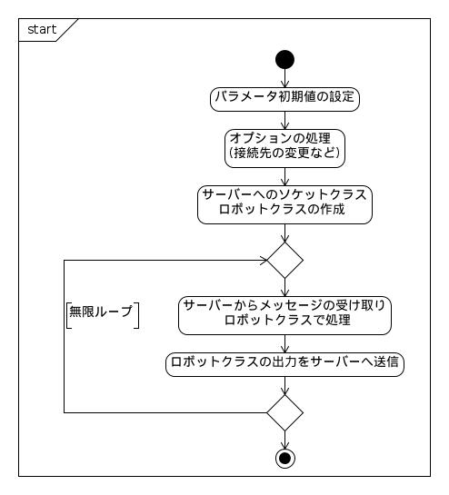

#main.cpp
##概要
main関数です。

接続先、チーム名の基本値を記述します。  
オプションの処理を行います。（後述）  
サーバーとの通信を受け持つrcss3dsocketクラスを保持します。  
ロボットの動作を受け持つrobotクラスを保持します。  
socketとrobotの間でstd::stringを受け渡します。  

##オプション指定の例
接続先のサーバーIPを指定する。  
`$./hillstoneUnited --host=192.168.0.1`  
チーム名を変更する。  
`$./hillstoneUnited --team=newTeamName`

##関数の流れ

