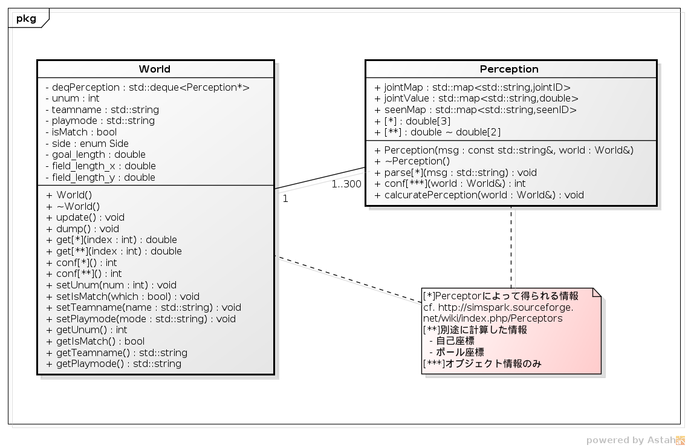
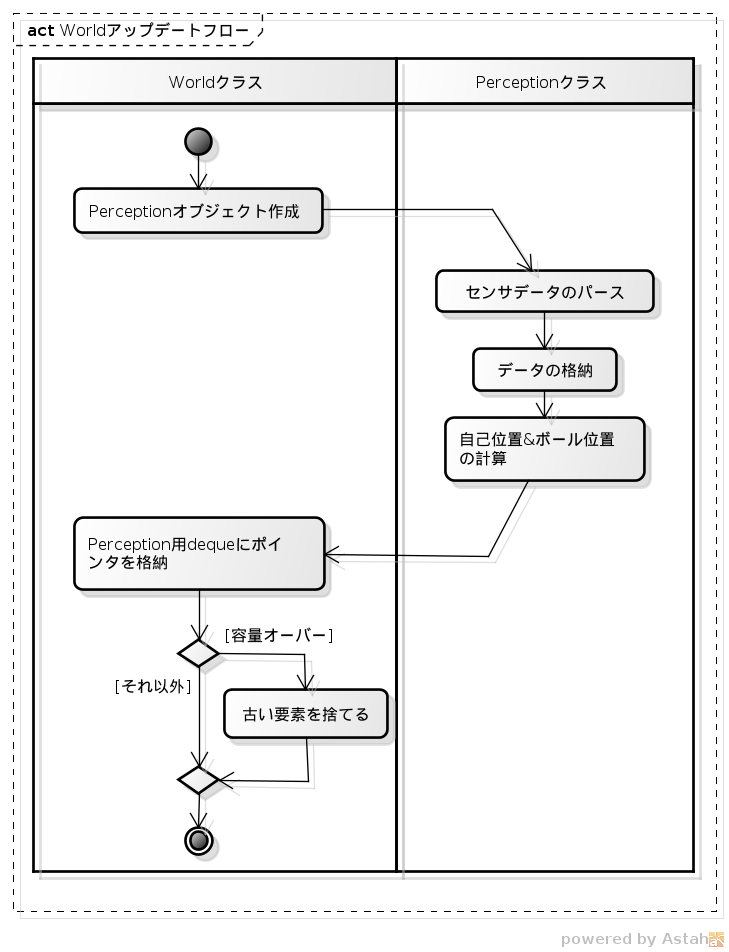

#World
---

　ここではエージェントプログラムのWorldクラスについて説明をします．  
Worldクラスは，ロボカップサーバから送られてきた情報を毎サイクルごと解析して値を格納するオブジェクトです．  

---
## Class Diagram

　Worldのクラス図は以下のようになっています：  

サーバから送られてきた情報はWorldの内部クラスであるPerceptionクラスによって配列として確保され，他のクラスはWorldのアクセサを介することによってそれら情報を取得することができます．  
エージェントの知覚によって得られる情報には，  
　- ジャイロ  
　- 関節角  
　- 床反力  
　- 加速度  
　- 視覚情報(ゴールポスト，フィールドフラッグ)  
などがあります．詳細は下記を参照してください．  

(cf. [AgentPerceptor(simspark page)](http://simspark.sourceforge.net/wiki/index.php/Perceptors))

---
## Main Routine

　また，次のようなアップデートルーチンにより情報を毎サイクル更新します．  

現在では300サイクル分のPerceptionオブジェクトをdequeによって管理しています．  

---
